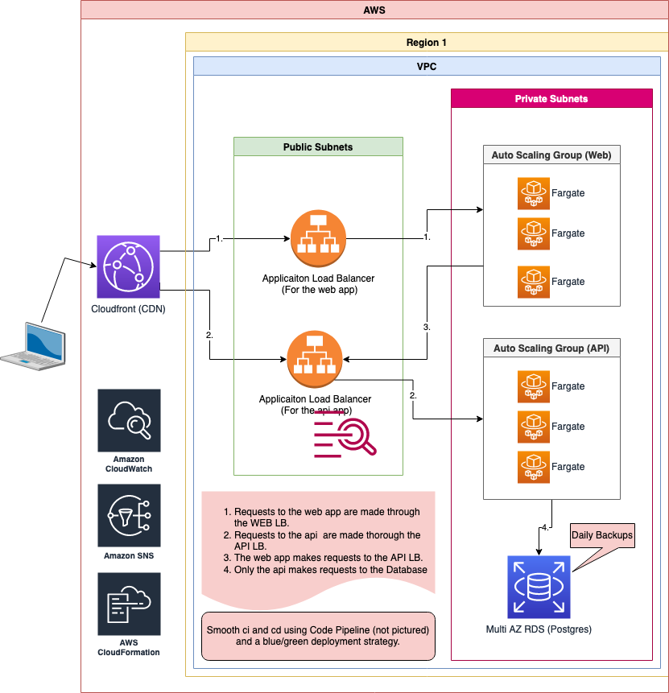

# Sample 3tier app
This repo contains code for a Node.js multi-tier application.

The application overview is as follows

```
web <=> api <=> db
```

The folders `web` and `api` respectively describe how to install and run each app.

# Description
This repo is a fully functional dockerized 3 tier nodejs app. With minor changes, nodejs
can be replace with any other language.

The architecture is built on AWS. It is fully automated and scalable. CI/CD is also fully
automated. It uses a Blue/Green strategy for deployments.

Some services that it uses are Cloudfront, ALB, ECS Fargate, RDS Postgres,
Cloudwatch, S3, CodeBuild, CodeDeploy, CodeCommit and Code Pipeline.

## Architecture


##  Local testing (using docker compose)
Just run:
```
docker-compose up --build
```

## Initial Setup
0. Clone repo

1. Deploy VPC
```
aws cloudformation create-stack --stack-name app-vpc --template-body "file://aws/01-vpc.yaml" --parameters ParameterKey=Env,ParameterValue=prod
```

2. Deploy Infra (lb, ecr, db, etc...)
```
aws cloudformation create-stack --stack-name app-infra --template-body "file://aws/02-infra.yaml" --parameters ParameterKey=NetworkStackName,ParameterValue=app-vpc ParameterKey=DBMasterUser,ParameterValue=appmasteruser ParameterKey=DBMasterPass,ParameterValue=password ParameterKey=DBName,ParameterValue=appdb
```

**NOTE**: _After this step_, *we'll need to push the docker images to the ECR repo*.

3. Deploy App Service
```
aws cloudformation create-stack --stack-name poc-ci-cd-apps --template-body "file://aws/03-service.yaml" --parameters ParameterKey=NetworkStackName,ParameterValue=app-vpc ParameterKey=ClusterStackName,ParameterValue=app-infra --capabilities CAPABILITY_IAM
```

**NOTE**: _After this step_, *we'll need to modify the buildspecs.yaml of each app and the change the service name*.

4. Deploy Code Pipeline
```
aws cloudformation create-stack --stack-name poc-ci-cd-code-deploy-app --template-body "file://aws/04-code-deploy-app.yaml" --capabilities CAPABILITY_NAMED_IAM --parameters ParameterKey=ClusterStackName,ParameterValue=poc-ci-cd-infra ParameterKey=ServiceStackName,ParameterValue=poc-ci-cd-apps
```
